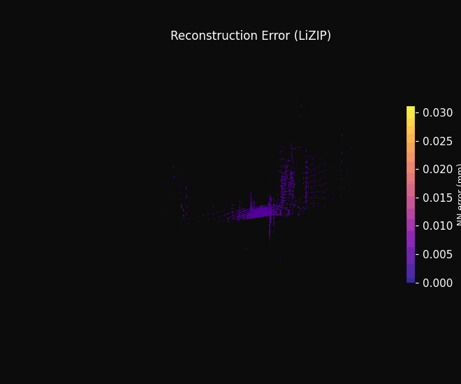
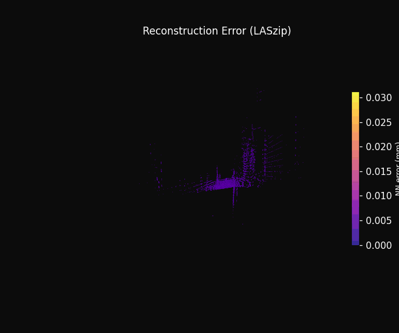
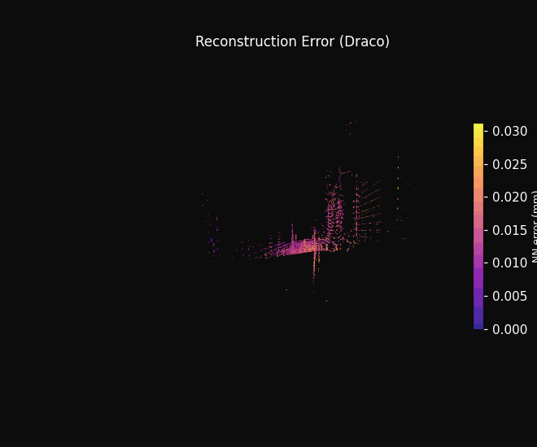

# LiZIP: An Auto-Regressive Compression Framework for LiDAR Point Clouds

This repo is the official code base for **LiZIP**, a lightweight near-lossless compression framework for LiDAR point clouds based on neural predictive coding. The project website is [here](https://hwudlabairoboticsreseach.github.io/LiZIP/).

<div align="center">
  
  
  
</div>

---

## Key Results

- **7.5%–14.8%** smaller files than the industry-standard LASzip across NuScenes and Argoverse.
- **8.8%–11.3%** smaller than Google Draco (24-bit precision baseline) while keeping reconstruction error ≤ 0.017 mm vs. Draco's 0.033–0.070 mm.
- **38%–48%** smaller than GZip — a 3.8× compression ratio on a typical NuScenes frame (683.9 KB raw → 184.8 KB).
- Runs entirely on **CPU** (~75 ms/frame, C++ backend with AVX2 + OpenMP). No GPU required at inference time.
- Generalises to the unseen **Argoverse** dataset without retraining.

---

## Getting Started

### Prerequisites

- Python 3.9+
- A C++ compiler with OpenMP support (for the C++ backend)

### Installation

```bash
git clone https://github.com/HWUDLabAIRoboticsReseach/LiZIP
cd LiZIP
pip install -r requirements.txt
```

---

## Usage

### Encode a point cloud

```bash
# Python backend (default model: mlp_c3_h256)
python main.py encode input.bin output.lizip

# C++ backend — faster, recommended
python main.py encode input.bin output.lizip --mode cpp

# Best compression ratio (lzma)
python main.py encode input.bin output.lizip --mode cpp --compression lzma

# Custom model variant
python main.py encode input.bin output.lizip --model models/grid_search/mlp_c8_h1024.bin --mode cpp
```

### Decode

```bash
python main.py decode output.lizip reconstructed.bin --mode cpp
```

### Compare original vs. reconstructed

```bash
python src/utils/compare.py input.bin reconstructed.bin
```

Reports Chamfer distance, Hausdorff distance, and p95/p99 nearest-neighbour error in mm.

### Benchmark against Draco, LASzip and GZip

```bash
python main.py benchmark --dataset nuscenes --frames 100 --mode dual
```

---

## Models

Nine pre-trained `PointPredictorMLP` variants are provided under `models/grid_search/`, covering three context sizes (k = 3, 5, 8) and three hidden dimensions (H = 256, 512, 1024). Each variant ships as both a PyTorch `.pth` checkpoint and a self-contained `.bin` binary (LIZM format) for the C++ engine.

| k | H    | Encode (s) | Size (KB) | Error (mm) |
|---|------|-----------|-----------|------------|
| **3** | **256** | **0.19** | **185.41** | **0.010** |
| 3 | 512  | 0.31      | —         | —          |
| 3 | 1024 | 1.06      | —         | —          |
| 5 | 256  | 0.18      | 186.17    | —          |
| 5 | 1024 | 1.03      | —         | —          |
| 8 | 1024 | 1.23      | 184.50    | —          |

The default model is `mlp_c3_h256` (bold above).

---

## Visualisation Tools

Generate the GIFs shown above from any NuScenes `.bin` file:

```bash
# Rotating reconstruction error heatmap
python src/utils/make_error_heatmap_gif.py data/nuScenes/LIDAR_TOP/<frame>.bin --out error_heatmap.gif

# Residual distribution tightening animation
python src/utils/make_residual_dist_gif.py data/nuScenes/LIDAR_TOP/<frame>.bin --out residual_dist.gif
```

Both scripts require `imageio` in addition to the standard requirements:

```bash
pip install imageio
```

---

## Citation

```bibtex
@misc{shibu2026lizipautoregressivecompressionframework,
      title={LiZIP: An Auto-Regressive Compression Framework for LiDAR Point Clouds},
      author={Aditya Shibu and Kayvan Karim and Claudio Zito},
      year={2026},
      eprint={2603.23162},
      archivePrefix={arXiv},
      primaryClass={cs.RO},
      url={https://arxiv.org/abs/2603.23162},
}
```
